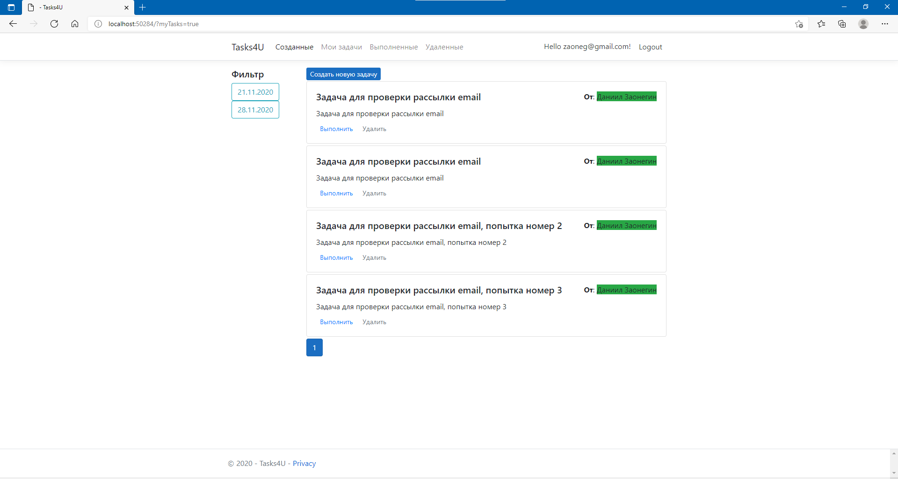

# Tasks4U application
 
In this application you can receive a task from somebody and set one for someone.

Users can be registered using their google account or can create a new user.

Application uses azure function to send emails [UploadEmailMessagesHttpTriggerFunction](https://github.com/daniilzaonegin/UploadEmailMessagesHttpTriggerFunction)